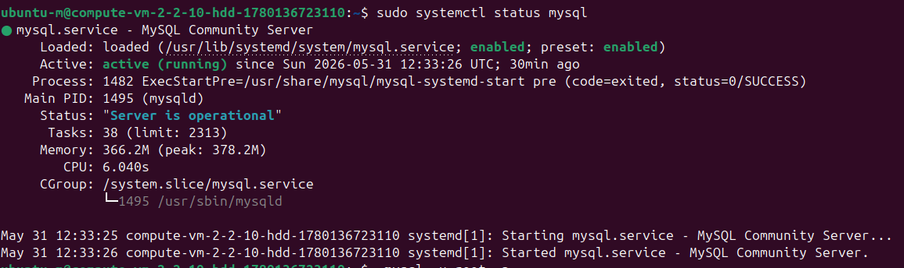
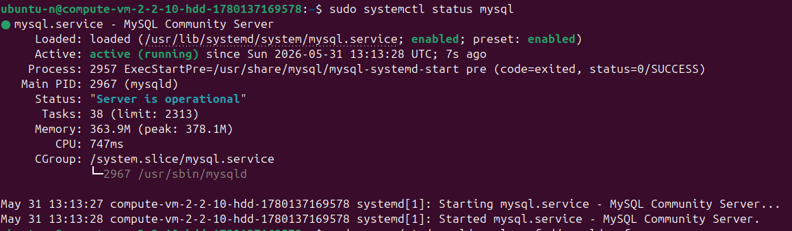
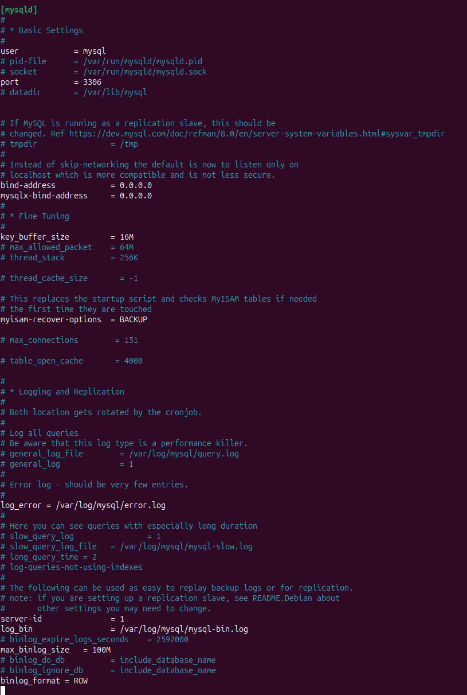
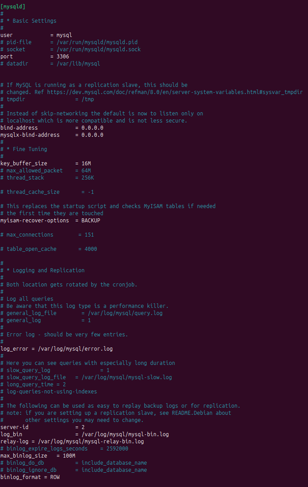
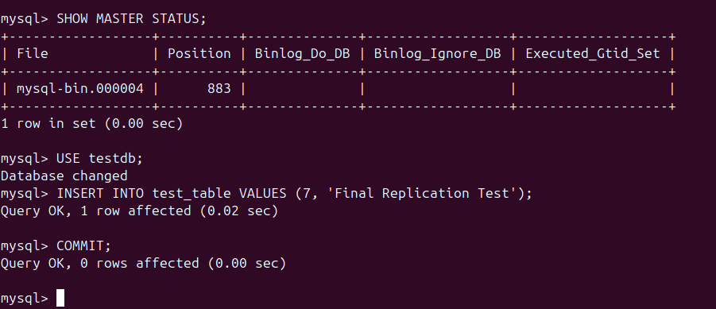
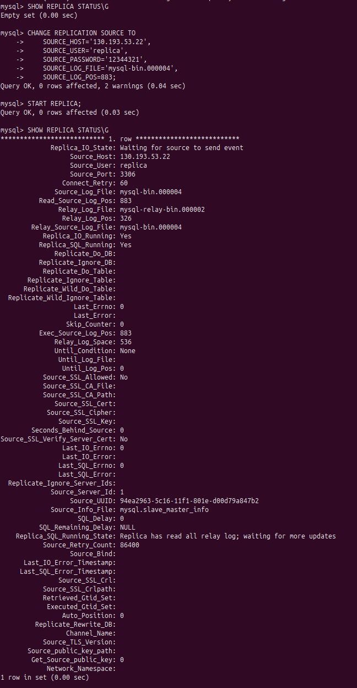

# Домашнее задание к занятию «Репликация и масштабирование. Часть 1»

**Выполнил:** Чехлов Михаил

# Задание 1: Сравнение режимов репликации баз данных

## Цель

Изучить и сравнить два основных режима репликации баз данных: **master‑slave** и **master‑master**. Описать их ключевые различия, преимущества, недостатки и сценарии применения.

## Режим репликации master‑slave

**Master‑slave** — асимметричная модель репликации с одним главным сервером (**master**) и одним или несколькими подчинёнными (**slave**).

### Характеристики

* **Запись данных**: выполняется **только на master‑сервере** (`INSERT`, `UPDATE`, `DELETE`).
* **Чтение данных**: возможно как с **master**, так и со **slave**‑серверов (позволяет распределить нагрузку).
* **Репликация**: обычно **асинхронная**:
    * master записывает изменения в **бинарный лог** (`binary log`);
    * slave периодически опрашивает master и применяет изменения.
* **Отказоустойчивость**:
    * slave‑серверы служат **резервными копиями**;
    * при сбое master один из slave можно перевести в режим master (вручную или автоматически).
* **Сложность настройки**: низкая.

### Сценарии использования

* Масштабирование операций чтения (например, для веб‑приложений с высокой нагрузкой).
* Резервное копирование без остановки работы основной базы.
* Аналитика и отчётность (чтобы не нагружать основной сервер).

## Режим репликации master‑master

**Master‑master** — симметричная модель, где **каждый сервер может выполнять роль master**.

### Характеристики

* **Запись данных**: возможна **на любом сервере**.
* **Чтение данных**: доступно с любого сервера.
* **Репликация**: **двусторонняя** (каждый сервер реплицирует свои изменения и принимает изменения от других).
* **Конфликты данных**: основная проблема. Возникают при одновременном изменении одних и тех же данных на разных серверах. Для разрешения используют:
    * приоритет по временной метке (последняя запись побеждает);
    * приоритет по идентификатору сервера (сервер с меньшим ID имеет преимущество);
    * специальные алгоритмы разрешения конфликтов.
* **Отказоустойчивость**: высокая (любой сервер может взять на себя полную нагрузку).
* **Сложность настройки**: высокая.

### Сценарии использования

* Географически распределённые системы (например, дата‑центры в разных регионах).
* Системы с требованиями к **высокой доступности (HA)**, где недопустимы простои.
* Балансировка нагрузки на запись между несколькими узлами.

## Сравнительная таблица

| Параметр | Master‑slave | Master‑master |
|--------|-------------|--------------|
| **Запись** | Только на master | На любом сервере |
| **Чтение** | С master и slave | С любого сервера |
| **Направление репликации** | Одностороннее (master → slave) | Двустороннее (между всеми серверами) |
| **Конфликты данных** | Отсутствуют | Возможны, требуется механизм разрешения |
| **Сложность настройки** | Низкая | Высокая |
| **Отказоустойчивость** | Средняя (требуется переключение) | Высокая (автоматическое переключение) |
| **Масштабирование чтения** | Отличное (добавление slave‑серверов) | Хорошее |
| **Масштабирование записи** | Отсутствует (запись только на master) | Хорошее (запись на все узлы) |
| **Задержка репликации** | Обычно небольшая (асинхронно) | Может быть выше из‑за двусторонней синхронизации |
| **Типичное применение** | Веб‑сайты, аналитика, бэкапы | Распределённые системы, HA‑кластеры |

## Вывод

Выбор режима зависит от требований к системе:

**Используйте master‑slave, если:**
* основная нагрузка — чтение;
* нужна простая настройка и резервное копирование;
* допустима небольшая задержка репликации и ручное переключение при сбое.

**Используйте master‑master, если:**
* требуется высокая доступность и отказоустойчивость;
* нагрузка на запись распределена между несколькими географическими точками;
* вы готовы инвестировать время в настройку и решение потенциальных конфликтов данных.

# Задание 2: Настройка пользователя репликации на мастере

##  Статус службы MySQL (master)

##  Статус службы MySQL (slave)

##  Скриншот конфигурации MySQL (master)

##  Скриншот конфигурации MySQL (slave)

##  Скриншот вывода SHOW MASTER STATUS

##  Скриншот вывода SHOW REPLICA STATUS\G

